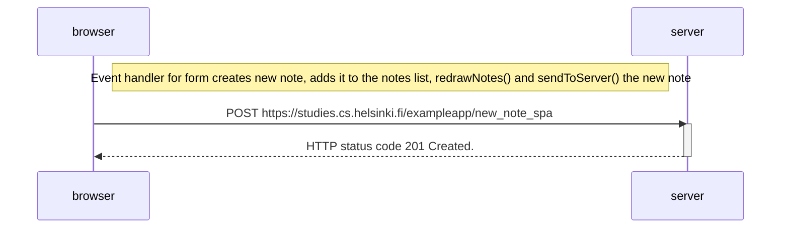

```mermaid
sequenceDiagram
participant browser
participant server

    Note right of browser: Event handler for form creates new note, adds it to the notes list, redrawNotes() and sendToServer() the new note

    browser->>server: POST https://studies.cs.helsinki.fi/exampleapp/new_note_spa
    activate server
    server-->>browser: HTTP status code 201 Created.
    deactivate server

```
